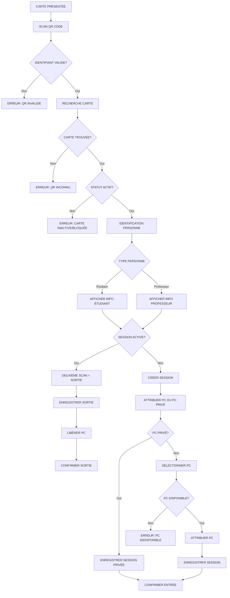
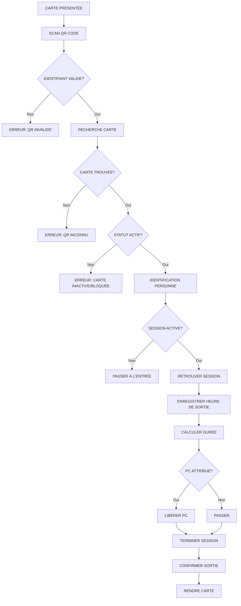
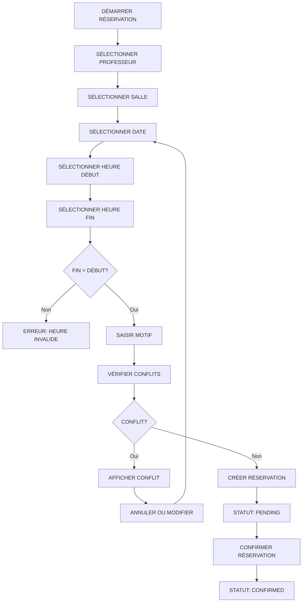
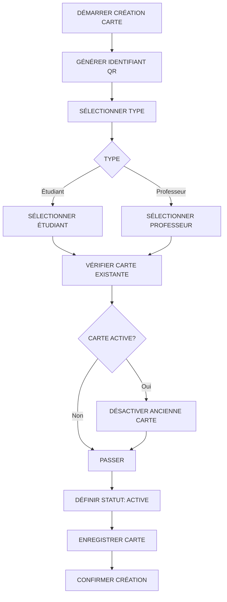
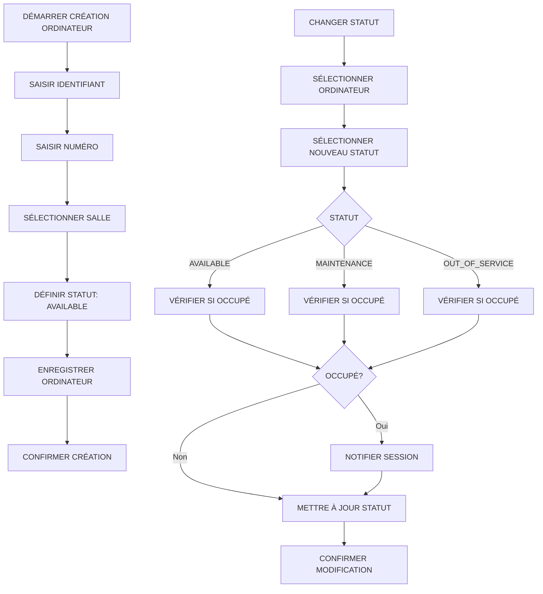
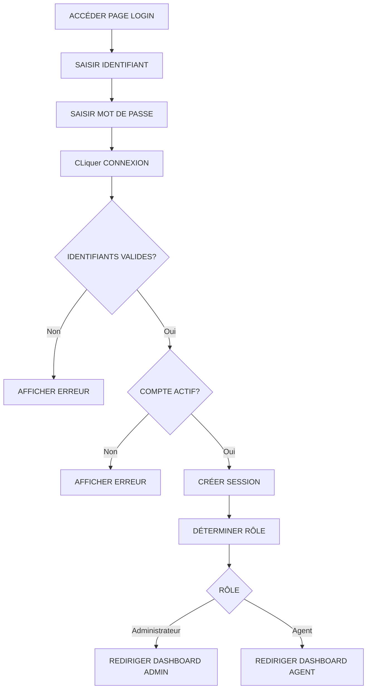
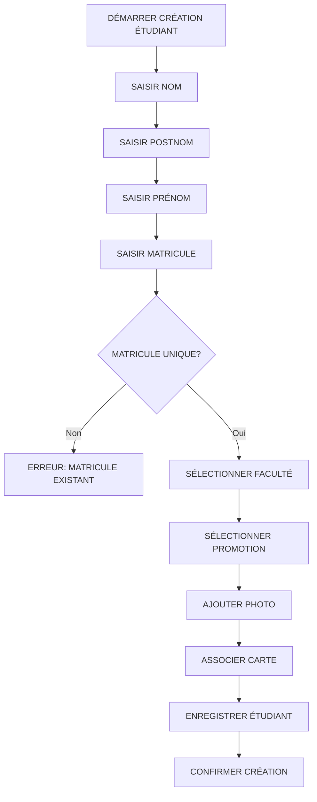
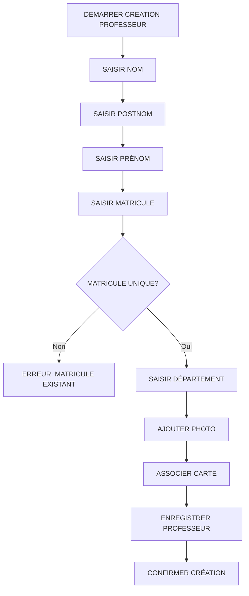

# Workflows - LabAccess

## 1. Vue d'Ensemble

Ce document définit les workflows principaux de LabAccess sous forme de diagrammes et descriptions étape par étape.

## 2. Workflow d'Entrée

### 2.1 Diagramme

### 2.2 Description Étape par Étape

#### Étape 1 : Présentation de la Carte
- L'étudiant ou professeur présente sa carte à l'agent
- L'agent prépare le scanner

#### Étape 2 : Scan QR Code
- L'agent scanne le QR Code de la carte
- Le système lit l'identifiant du QR Code

#### Étape 3 : Validation du Format
- Le système vérifie si l'identifiant respecte le format
- Format : `LAB-{TYPE}-{ANNÉE}-{NUMÉRO}`
- Si invalide : Afficher "QR Code invalide"

#### Étape 4 : Recherche de la Carte
- Le système recherche la carte dans la base de données
- Si inconnue : Afficher "QR Code inconnu"

#### Étape 5 : Vérification du Statut
- Le système vérifie le statut de la carte
- Si inactive ou bloquée : Afficher "Carte inactive/bloquée"

#### Étape 6 : Identification de la Personne
- Le système identifie la personne associée à la carte
- Le système détermine le type : étudiant ou professeur

#### Étape 7 : Affichage des Informations
- Le système affiche les informations de la personne
- Pour un étudiant : nom, postnom, prénom, matricule, faculté, promotion, photo
- Pour un professeur : nom, postnom, prénom, matricule, département, photo

#### Étape 8 : Vérification de Session Active
- Le système vérifie si la personne a une session active
- Si session active : Passer à l'étape de sortie (deuxième scan)

#### Étape 9 : Création de Session
- Le système crée une nouvelle session
- Le système enregistre l'heure d'entrée
- Le système enregistre l'agent

#### Étape 10 : Attribution de PC
- L'agent choisit entre PC du laboratoire ou PC privé
- Si PC privé : Passer à l'étape 12
- Si PC du laboratoire : Passer à l'étape 11

#### Étape 11 : Sélection de PC
- Le système affiche la liste des PC disponibles
- L'agent sélectionne un PC
- Le système vérifie la disponibilité du PC
- Le système attribue le PC
- Le système marque le PC comme occupé

#### Étape 12 : Enregistrement de Session
- Le système enregistre la session
- Le système associe le PC (si applicable)
- Le système enregistre le type de poste

#### Étape 13 : Confirmation
- Le système confirme l'entrée
- La personne peut entrer dans le laboratoire

---

## 3. Workflow de Sortie

### 3.1 Diagramme

### 3.2 Description Étape par Étape

#### Étape 1 : Présentation de la Carte
- La personne revient auprès de l'agent
- L'agent reprend la carte

#### Étape 2 : Scan QR Code
- L'agent scanne le QR Code de la carte
- Le système lit l'identifiant du QR Code

#### Étape 3 : Validation du Format
- Le système vérifie si l'identifiant respecte le format
- Si invalide : Afficher "QR Code invalide"

#### Étape 4 : Recherche de la Carte
- Le système recherche la carte dans la base de données
- Si inconnue : Afficher "QR Code inconnu"

#### Étape 5 : Vérification du Statut
- Le système vérifie le statut de la carte
- Si inactive ou bloquée : Afficher "Carte inactive/bloquée"

#### Étape 6 : Identification de la Personne
- Le système identifie la personne associée à la carte

#### Étape 7 : Vérification de Session Active
- Le système vérifie si la personne a une session active
- Si aucune session active : Passer au workflow d'entrée

#### Étape 8 : Retrouver la Session
- Le système retrouve la session active de la personne

#### Étape 9 : Enregistrer Heure de Sortie
- Le système enregistre l'heure de sortie actuelle
- Le système vérifie que l'heure de sortie est postérieure à l'heure d'entrée

#### Étape 10 : Calculer la Durée
- Le système calcule la durée de la session
- Durée = heure de sortie - heure d'entrée

#### Étape 11 : Libérer le PC
- Si un PC était attribué
- Le système libère le PC
- Le système marque le PC comme disponible

#### Étape 12 : Terminer la Session
- Le système termine la session
- Le système change le statut de "active" à "completed"

#### Étape 13 : Confirmation
- Le système confirme la sortie
- L'agent rend la carte à la personne

---

## 4. Workflow de Réservation

### 4.1 Diagramme

### 4.2 Description Étape par Étape

#### Étape 1 : Sélectionner Professeur
- L'utilisateur sélectionne le professeur qui fait la réservation
- Le professeur doit exister dans la base de données

#### Étape 2 : Sélectionner Salle
- L'utilisateur sélectionne la salle à réserver
- Types possibles : laboratory, auditorium

#### Étape 3 : Sélectionner Date
- L'utilisateur sélectionne la date de la réservation
- Format : YYYY-MM-DD

#### Étape 4 : Sélectionner Heure de Début
- L'utilisateur sélectionne l'heure de début
- Format : HH:mm

#### Étape 5 : Sélectionner Heure de Fin
- L'utilisateur sélectionne l'heure de fin
- Format : HH:mm
- Vérification : heure de fin > heure de début

#### Étape 6 : Saisir Motif
- L'utilisateur saisit le motif de la réservation
- Le motif est obligatoire

#### Étape 7 : Vérifier les Conflits
- Le système vérifie les réservations existantes pour la salle
- Le système vérifie les chevauchements de date et heures
- Si conflit : Afficher les détails du conflit

#### Étape 8 : Créer la Réservation
- Le système crée la réservation
- Statut initial : pending

#### Étape 9 : Confirmer la Réservation
- L'utilisateur confirme la réservation
- Statut : confirmed

---

## 5. Workflow de Gestion des Cartes

### 5.1 Diagramme

### 5.2 Description Étape par Étape

#### Étape 1 : Générer Identifiant QR
- Le système génère automatiquement un identifiant QR unique
- Format : `LAB-{TYPE}-{ANNÉE}-{NUMÉRO}`

#### Étape 2 : Sélectionner Type
- L'utilisateur sélectionne le type de carte
- Options : student, professor

#### Étape 3 : Sélectionner Personne
- Si type = student : Sélectionner un étudiant
- Si type = professor : Sélectionner un professeur

#### Étape 4 : Vérifier Carte Existante
- Le système vérifie si la personne a déjà une carte active
- Si oui : Désactiver l'ancienne carte automatiquement

#### Étape 5 : Définir Statut
- Le statut est défini à "active" par défaut

#### Étape 6 : Enregistrer Carte
- Le système enregistre la carte dans la base de données

#### Étape 7 : Confirmation
- Le système confirme la création de la carte

---

## 6. Workflow de Gestion des Ordinateurs

### 6.1 Diagramme

### 6.2 Description Étape par Étape

#### Création d'Ordinateur

##### Étape 1 : Saisir Identifiant
- L'utilisateur saisit l'identifiant de l'ordinateur
- L'identifiant doit être unique

##### Étape 2 : Saisir Numéro
- L'utilisateur saisit le numéro de l'ordinateur

##### Étape 3 : Sélectionner Salle
- L'utilisateur sélectionne la salle où se trouve l'ordinateur

##### Étape 4 : Définir Statut
- Le statut est défini à "available" par défaut

##### Étape 5 : Enregistrer
- Le système enregistre l'ordinateur

#### Changement de Statut

##### Étape 1 : Sélectionner Ordinateur
- L'utilisateur sélectionne l'ordinateur à modifier

##### Étape 2 : Sélectionner Nouveau Statut
- L'utilisateur sélectionne le nouveau statut
- Options : available, occupied, maintenance, out_of_service

##### Étape 3 : Vérifier Occupation
- Le système vérifie si l'ordinateur est occupé
- Si occupé : Notifier la session active

##### Étape 4 : Mettre à Jour
- Le système met à jour le statut

---

## 7. Workflow d'Authentification

### 7.1 Diagramme

### 7.2 Description Étape par Étape

#### Étape 1 : Saisir Identifiant
- L'utilisateur saisit son identifiant (email ou username)

#### Étape 2 : Saisir Mot de Passe
- L'utilisateur saisit son mot de passe

#### Étape 3 : Valider
- Le système valide les identifiants
- Le système vérifie le mot de passe haché

#### Étape 4 : Vérifier Compte
- Le système vérifie si le compte est actif

#### Étape 5 : Créer Session
- Le système crée une session utilisateur
- Le système génère un token ou utilise une session côté serveur

#### Étape 6 : Rediriger
- Selon le rôle, rediriger vers le dashboard approprié

---

## 8. Workflow de Gestion des Étudiants

### 8.1 Diagramme

### 8.2 Description Étape par Étape

#### Étape 1 : Saisir Informations Personnelles
- Nom
- Postnom
- Prénom
- Matricule (doit être unique)

#### Étape 2 : Sélectionner Faculté
- L'utilisateur sélectionne la faculté de l'étudiant

#### Étape 3 : Sélectionner Promotion
- L'utilisateur sélectionne la promotion de l'étudiant

#### Étape 4 : Ajouter Photo
- L'utilisateur peut ajouter une photo de l'étudiant

#### Étape 5 : Associer Carte
- L'utilisateur peut associer une carte existante
- Ou créer une nouvelle carte

#### Étape 6 : Enregistrer
- Le système enregistre l'étudiant

---

## 9. Workflow de Gestion des Professeurs

### 9.1 Diagramme

### 9.2 Description Étape par Étape

#### Étape 1 : Saisir Informations Personnelles
- Nom
- Postnom
- Prénom
- Matricule (doit être unique)

#### Étape 2 : Saisir Département
- L'utilisateur saisit le département du professeur

#### Étape 3 : Ajouter Photo
- L'utilisateur peut ajouter une photo du professeur

#### Étape 4 : Associer Carte
- L'utilisateur peut associer une carte existante
- Ou créer une nouvelle carte

#### Étape 5 : Enregistrer
- Le système enregistre le professeur

---

## 10. Conclusion

Ces workflows définissent les processus principaux de LabAccess. Ils doivent être suivis lors du développement pour garantir que le système fonctionne conformément aux spécifications.
